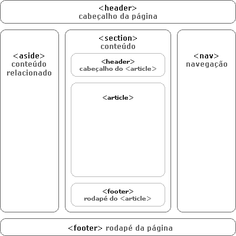

### Conteúdo - Aulas de HTML5

Este repostitório esta destinado aos discentes do componente curricular de Técnicas de Programação para Internet I (HTML, CSS, JavaScript).

HTML – HyperText Markup Language
Todas as páginas da web são feitas em HTML. 
O HTML não é uma linguagem de programação, e sim uma linguagem de marcação. Na sua missão de aprender programação, ela servirá pra você começar e entender como falar com o computador, como dar instruções pra ele e como escrever algo que ele entenda. 
É fácil aprender HTML e você não irá sofrer quase nada. 
Por outro lado ela servirá pra você se acostumar a quebrar a cara; escrever alguns comandos e não funcionar… isso é importante, porque faz parte da rotina na programação.

Elementos de estrutura:

<header> - cabeçalho da página ou de uma seção (não confundir com a tag <head>);
<section> - cada seção do conteúdo;
<article> - um item do conteúdo dentro da página ou da seção;
<footer> - o rodapé da página ou de uma seção;
<nav> - o conjunto de links que formam a navegação, seja o menu principal do site ou links relacionados ao conteúdo da página;
<aside> - conteúdo relacionado ao artigo (como arquivos e posts relacionados em um blog, por exemplo).

  

